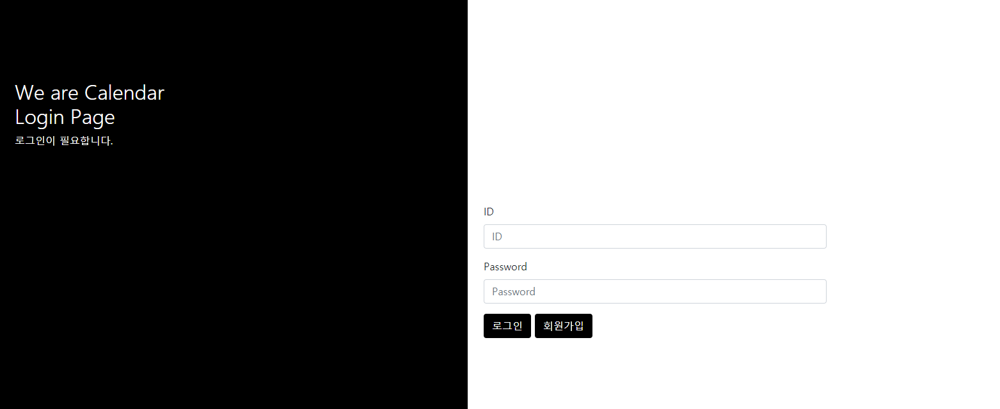
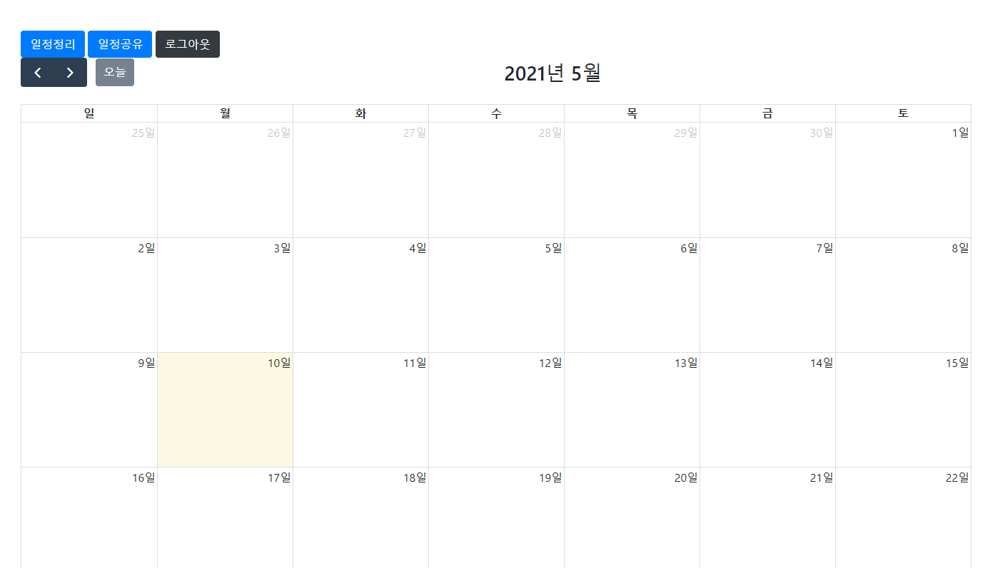
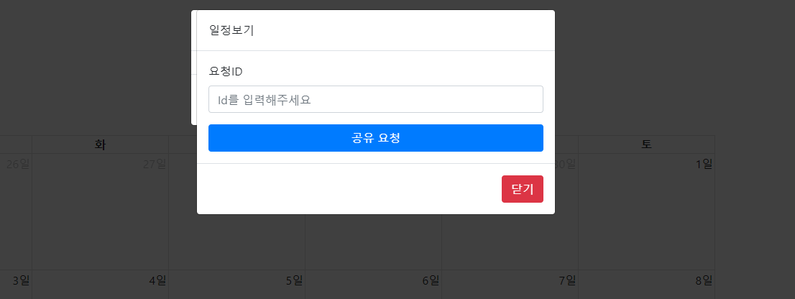
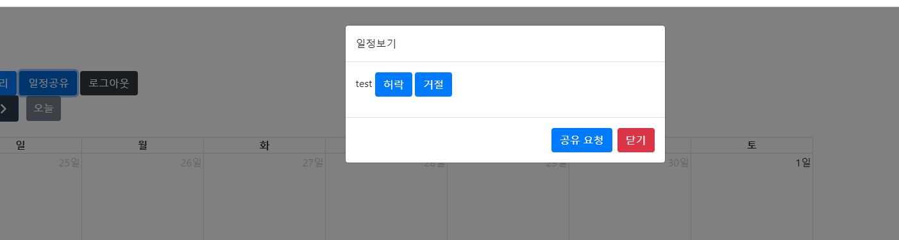
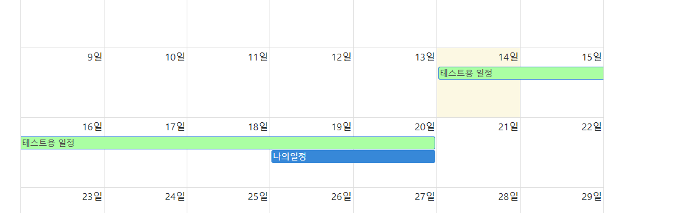

# We are Calendar
Fullcalendar 라이브러리를 활용한 todo web app

**too**l:bootstrap

**IDE**:InteliJ

**language**:java

**framework**:spring, freemarker, 


## 개요

배운 springframework와 jsp이외의 템플릿 엔진을 써봄으로써 기존에 정형화 되어있던 개발을 바꿔보고 외부 라이브러리를 사용하는 법을 학습을 목적으로

프로젝트 시작


## database

Author

calendar

userinfo

세개의 테이블로 구성되어있으며

Author와 calendar은

userinfo의 unique key 인 username에 foreginkey로 테이블 끼리 연결되어있음

username이 사라지면 나머지 테이블에서도 레코드가 삭제되는 cascade 제약으로 묶어놨음.


## Loginpage



로그인 페이지

간단하게 로그인 구현

회원가입 페이지도 디자인은 크게 다르지않음


Controller

```java
@GetMapping(path = "/login")
public ModelAndView login(HttpServletResponse response, HttpSession session) throws IOException {
    if (session.getAttribute("userinfo") != null) {
        response.sendRedirect("/main");
    }
    ModelAndView modelAndView = new ModelAndView("login");
    modelAndView.addObject("msg", "");
    return modelAndView;
}

```

```java
@PostMapping(path = "/login")
public ModelAndView login(HttpServletRequest request, HttpServletResponse response, HttpSession session) throws IOException {
    if (!userService.logincheck(request, session)) {
        ModelAndView modelAndView = new ModelAndView("login");
        modelAndView.addObject("msg", "잘못된 입력값 입니다");
        return modelAndView;
    } else {
        ModelAndView modelAndView = new ModelAndView("main");
        response.sendRedirect("/main");
        return modelAndView;
    }
}
```

freemarker 특성상 null값 자체를 인정하지 않기 때문에 freemarker에서 지정하고있는 변수가 있을경우 빈값이라도 보내줘야 페이지가 제대로 동작함.

그렇기 때문에 getmapping에서도 msg attribute를 빈값으로 채워서 보냄


## mainpage



간단한 react 기반의 fullcalendar 라이브러리를 사용하여 구현해준 모습


```java
@GetMapping(path = "/main")
public ModelAndView main(HttpSession session) {
    User user = (User) session.getAttribute("userinfo");
    ModelAndView modelAndView = new ModelAndView("main");
    System.out.println("세션에저장되있는 id는:"+user.getId());
    List<String> allowNameList = authorService.getAllowOkNameList(user.getName());
    List<DayCal> myCalList = calendarService.viewCalendar(user.getId());
    List<Author> waitAllowList = authorService.getAllowWaitList(user.getName());
    List<DayCal> otherCalList = calendarService.viewCalendarOther(allowNameList);

    modelAndView.addObject("calendarlist", myCalList);
    modelAndView.addObject("waitallowlist", waitAllowList);
    modelAndView.addObject("othercallist", otherCalList);
    return modelAndView;
}
```

이 메인 페이지에서는 restapi를 이용한 비동기방법과 동기방법을 통합시켯음

일정 정리 버튼을 통해 일정을 등록하면 동기방법 

캘린더를 클릭하면 나오는 modal을 통해 일정을 등록하면 비동기 방법으로 일정이 등록됨


동기-mainController

```java
@PostMapping("/mycalendar")
public void saveCalendar(@ModelAttribute PreCal precal, HttpServletResponse response, HttpSession session) throws IOException {
    User user = (User) session.getAttribute("userinfo");
    calendarService.insertUpdateCalendar(precal, user);
    response.sendRedirect("/main");
}
```


비동기-MainRestController

```java
@GetMapping("/CalRestView")
public @ResponseBody
RestObject View(HttpSession session) {
    User user = (User) session.getAttribute("userinfo");
    RestObject restObject;
    if (user == null) {
        restObject = restService.loginFailureObject();
    } else {
        restObject = restService.viewCalendarRest(user.getId());
    }
    return restObject;
}
```

```java
j@PostMapping("/CalRestSave")
public @ResponseBody
RestObject insertUpdate(PreCal preCal, HttpSession session) {
    User user = (User) session.getAttribute("userinfo");
    RestObject restObject;
    if (user == null) {
        restObject = restService.loginFailureObject();
    } else {
        restObject = restService.insertUpdateCalendarRest(preCal, user);
    }
    return restObject;
}
```

또한 rest로 등록하게되면 결과를 받아와 자동으로 event를 등록하게 해주는 js 코드를 작성했음


## 공유기능





요청 id를 받아 요청을 보내기되면 요청 받은 id 쪽에서 저런식으로 뜨게되고 허락을 하게되면



이런식으로 친구의 일정이 나에게도 뜨게됨


```java
@PostMapping("/allow")
public ModelAndView allow(@RequestParam String name, HttpSession session) throws IOException {
    return allows("allow", name, session);
}

@GetMapping("/allowOk")
public ModelAndView allowOk(@RequestParam String name, HttpSession session) throws IOException {
    return allows("allowOk", name, session);
}

@GetMapping("/deleteAllow")
public ModelAndView deleteAllow(@RequestParam String name, HttpSession session) throws IOException {
    System.out.println("method:" + name);
    return allows("delete", name, session);
}

public ModelAndView allows(String command, String name, HttpSession session) {
    User user = (User) session.getAttribute("userinfo");
    User target = userService.getUserByName(name);
    ModelAndView modelAndView = new ModelAndView("allow");
    String message = "";
    if (command.equals("allow")) {
        message = authorService.goAllow(user, target);
    } else if (command.equals("allowOk")) {
        message = authorService.allowOk(user, target);
    } else if (command.equals("delete")) {
        message = authorService.deleteAllow(user, target);
    }
    modelAndView.addObject("message", message);
    return modelAndView;
}
```


## 소감

시간제약을 두고 급하게 만들었고 처음써보는 템플릿엔진덕에 어떤게 원인인지 파악하는게 굉장히 오래걸렷음

freemarker 템플릿 엔진의 null값을 허용하지않는다는 사실이 굉장히 코드를 적용하는데 애를 쏟게 만들었고 js는 분명 적용됫는데 실패함수가 뜨는원인을 아직도 찾지 못하고 있음

그러나 rest 방식으로 만들고 비동기적으로 페이지를 계획하니 refresh를 반복하는것보다 굉장히 사용자경험이 좋다는것을 깨닫게 되었다....

